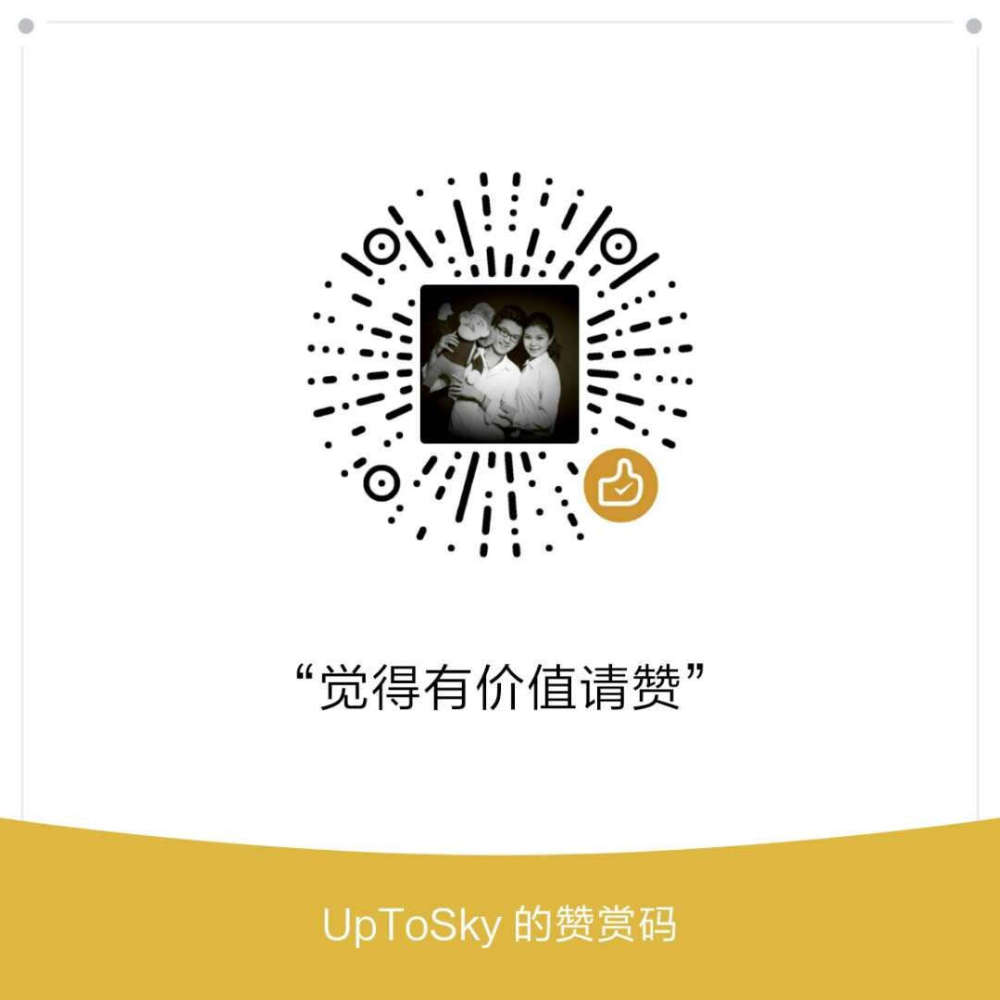

# GeekTimeTechnicalPresentationGuide
**记录在《极客时间》平台上《如何做好一场技术演讲》专栏的学习笔记**  
**作者信息：极客时间**    
**课程海报如下：** 
 
 

# 目录
* [第1讲 演讲之前需要做好哪些准备？](#1)
* [第2讲 怎样有效避免演讲前的紧张情绪？](#2)
* [第3讲 如何在演讲中讲个好故事？](#3)
* [第4讲 如何把你的观点深深地刻在别人的脑海中？](#4)
* [第5讲 演讲中的肢体语言管理和声音控制有哪些门道？](#5)
* [第6讲 8个技巧，帮你做一场漂亮的技术大会演讲](#6)
* [完结](#99)

# 正文
<h2 id="1">第1讲 演讲之前需要做好哪些准备</h2>
<h2 id="2">第2讲 怎样有效避免演讲前的紧张情绪</h2>
<h2 id="3">第3讲 如何在演讲中讲个好故事？</h2>
<h2 id="4">第4讲 如何把你的观点深深地刻在别人的脑海中？</h2>
<h2 id="5">第5讲 演讲中的肢体语言管理和声音控制有哪些门道？</h2>
<h2 id="6">第6讲 8个技巧，帮你做一场漂亮的技术大会演讲</h2>
<h2 id="7">完结</h2>

## 觉得有价值 感谢支持
 
